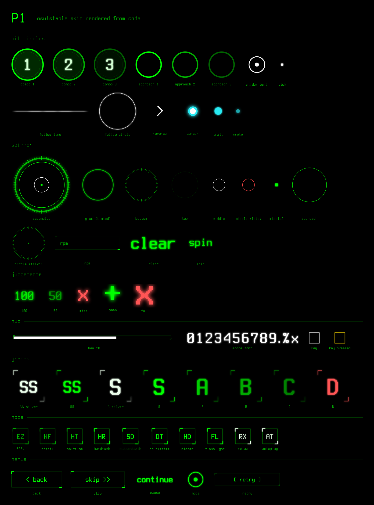

# P1

An osu!stable skin rendered from code. Black screen, phosphor green, a terminal font, and an oscilloscope on the main menu. The name is the code for the classic green phosphor in old terminals and scopes.



Every image is drawn by `gen.py` with Pillow. Change a colour or a stroke width, rerun it, and the whole skin follows.

## Download

Grab `P1.osk` from [Releases](https://github.com/pxlwh/p1-osu-skin/releases) and open it; osu! imports it. The release includes sounds, see [Credits](#credits).

## Build

Requirements: Python 3, [Pillow](https://pypi.org/project/pillow/), fontconfig (`fc-match`), and [Terminess Nerd Font](https://www.nerdfonts.com/) installed system wide.

```sh
python3 gen.py out/P1
```

Copy `out/P1` into your osu! `Skins` folder and pick **P1** in Options > Skin.

This builds the visuals only, with no sounds, so osu! uses its default sounds. To pull sounds from skins you already own:

```sh
python3 gen.py out/P1 --assets "Skins/Some Skin" --hitsounds "Skins/Other Skin" --osk P1.osk
```

* `--assets` takes every sound from that skin.
* `--hitsounds` replaces only the gameplay sounds (hit, slider, nightcore, combobreak) with another skin's set. Any matching sound from `--assets` is removed first, in every extension and numbering, so two sets never mix.
* `--osk` also packs the finished skin into an `.osk` (a zip of the skin folder).

Rebuild into a fresh folder and replace the old one. Hidden elements are blank `@1x` files, and a stale `@2x` left behind by a previous build would win over them.

## How it is drawn

* **4x supersampling.** Each element is drawn at four times its `@2x` size, then downsampled to `@2x` and `@1x`. Edges and thin rings come out smooth without a separate antialiasing pass.
* **White where the game tints.** osu! multiplies hit circles, approach circles, the slider ball, input keys and song select cards by a colour at draw time. Those are drawn white or grey so the combo colour shows through unchanged.
* **Hidden, not missing.** Lighting, particles, combo bursts, kiai fountains, the cursor trail and the slider tail circle are 1x1 transparent images. A missing file falls back to the default skin, so hiding takes a file.
* **Palette.** `#00ff00` with dim tiers, three combo greens stepped by brightness (`0,255,0`, `0,165,0`, `0,95,0`), and `#ff5555` for misses only.

## Limits of stable skinning

Some things a skin cannot change in osu!stable: the progress pie, the hit error bar colours, leaderboard names, and the colours the game uses for pressed input keys. Slider bodies are a dark neutral because a per combo body renders at full brightness and there is no opacity setting.

## License

MIT for everything in this repository. The font is not included; Terminess Nerd Font is under the SIL Open Font License.

## Credits

The sounds in the release `.osk` are not part of this repository and not covered by its license. Menu and interface sounds come from the Beafowl skin (skin.ini author: Garin); gameplay hitsounds come from the Stars in The Sky skin (author not listed). They are included with credit; if you are an author and want them removed, open an issue and they will be.
